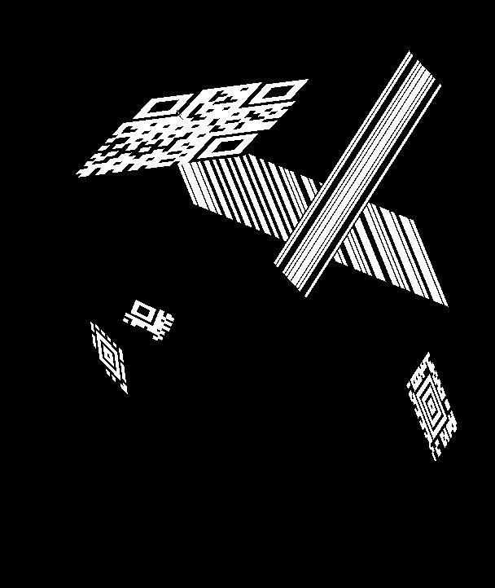
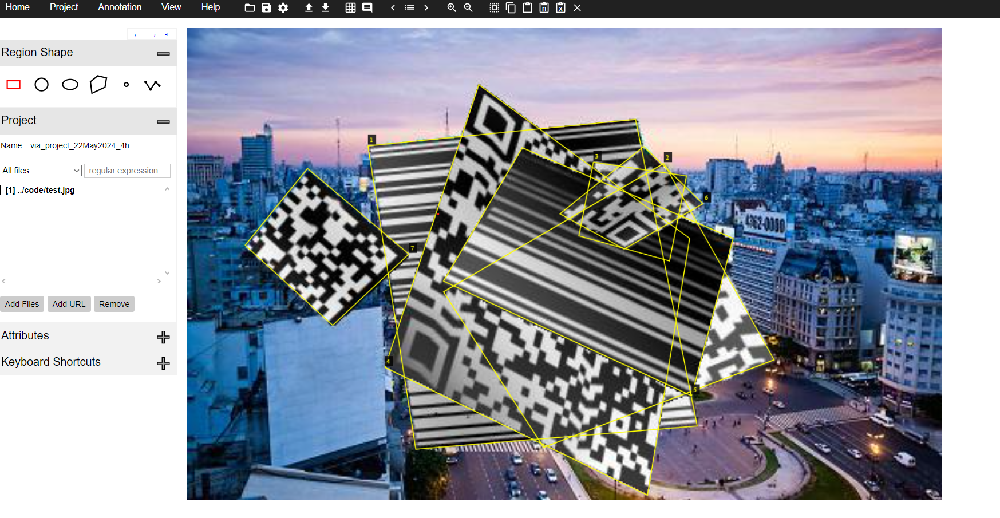

# Финальный отчёт

## Постановка задачи
Написать утилиту для програмной генерации изображений баркодов приближенных к реалистичным.

## Ожидаемый результат
Программа которая генерирует изображение c баркодами и разметку расположения баркодов как в VIA (VGG Image Annotator)

## Шаги решения задачи
1. Выбрать библиотеку для генерации баркодов (были протестированы 3 библиотеки и был выбран `treepoem` как с самой широкой поддержкой баркодов)
2. Афинная деформация - реализована случайная афинная деформация баркода, в эмпирически подобраны параметры нормировки чтобы изображение не съезжало с экрана.
3. Написать код генерации разметки в формате VGG
4. Добавление произвольного заднего фона и произвольного количества баркодов: для этого я генерирую маску и деформирую её вместе с баркодом чтобы после этого корректно наложить баркод на изображение
5. Случайная деформация перспективой. Возникла сложность с параметрами нормировки чтобы изображение не слишком деформировалось, было использовано решение с эмпирическими коэффициентами для суммы случайных матриц
6. Модификация случайной деформации перспективой для гарантии читаемости баркода - деформация перспективой генерируется на основе перемещения углов баркода, что позволяет гарантировать его читаемость
7. Добавлены аугментации из `augraphy`
8. Автоматизирована генерация входных данных для самых популярных баркодов для генерации баркодов в `treepoem`

## Результат
Программа которая генерирует изображение c случайно деформированными перспективой баркодами с различными аугментациеми бумаги плохого качества и разметку расположения баркодов как в VIA (VGG Image Annotator) на основе конфига и входного изображения

## Запуск
### Инструкция
Чтобы сгенерировать изображение с  баркодами нужно запустить скрипт `generator.py` и передать в него параметр `-с=` файл с конфигом:
`python .\generator.py -c="test_conf.json"`

#### Структура конфига
Конфиг - это json в файл в котором нужно указать следующие поля:
- `barcode_types` - список из типов баркодов (список поддерживающих генерацию контента можно найти в файле `data_generator.py`, а список всех доступных можно найти в документации `treepoem`)
- `name` - имя файла в который сохранится картинка и в который сохранится разметка
Опционально можно добавить:
- `barcode_contents` - список строк или чисел которые будут записаны в баркодах
- `source_img` - путь до изображения поверх которого будет рисоваться баркоды
- `augmentations` - список аугментаций которые будут применены к баркодам, сверяйтесь с `augmentations.py`

### Пример запуска
Запуск с текущим конфигом `python .\generator.py -c="test_conf.json"` генерирует следующее изображение:

После импорта в VIA выглядит вот так:

