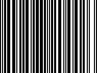
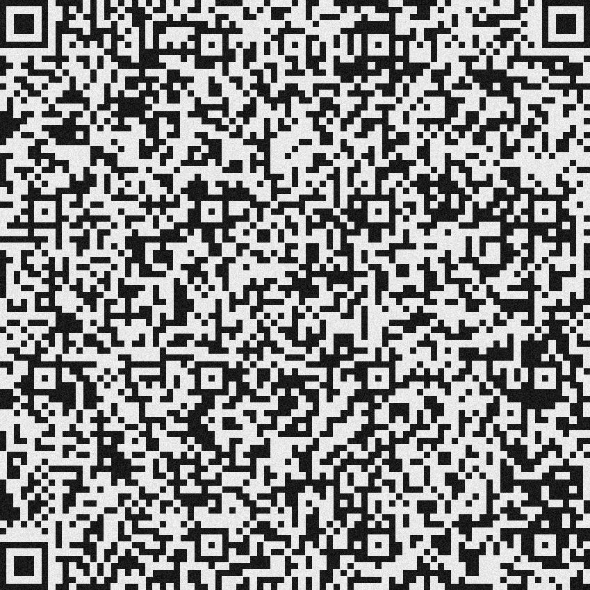
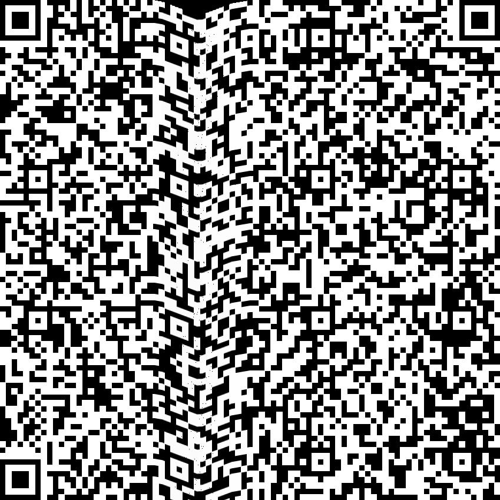

# Финальный отчёт

## Постановка задачи
Написать утилиту для программной генерации изображений бар кодов приближенных к реалистичным.

## Ожидаемый результат
Программа которая генерирует изображение c бар кодами и разметку расположения бар кодов как в VIA (VGG Image Annotator)

## Шаги решения задачи
1. Выбрать библиотеку для генерации бар кодов (были протестированы 3 библиотеки и был выбран `treepoem` как с самой широкой поддержкой бар кодов)
2. Аффинная деформация - реализована случайная аффинная деформация бар кода, в эмпирически подобраны параметры нормировки чтобы изображение не съезжало с экрана.
3. Написать код генерации разметки в формате VGG
4. Добавление произвольного заднего фона и произвольного количества бар кодов: для этого я генерирую маску и деформирую её вместе с бар кодом чтобы после этого корректно наложить бар код на изображение
5. Случайная деформация перспективой. Возникла сложность с параметрами нормировки чтобы изображение не слишком деформировалось, было использовано решение с эмпирическими коэффициентами для суммы случайных матриц
6. Модификация случайной деформации перспективой для гарантии читаемости бар кода - деформация перспективой генерируется на основе перемещения углов бар кода, что позволяет гарантировать его читаемость
7. Добавлены аугментации из `augraphy`
8. Автоматизирована генерация входных данных для самых популярных бар кодов для генерации бар кодов в `treepoem`

## Результат
Программа которая генерирует изображение c случайно деформированными перспективой бар кодами с различными аугментациями бумаги плохого качества и разметку расположения бар кодов как в VIA (VGG Image Annotator) на основе конфига и входного изображения

## Запуск
### Инструкция
Чтобы сгенерировать изображение с  бар кодами нужно запустить скрипт `generator.py` и передать в него параметр `-с=` файл с конфигом:
`python .\generator.py -c="test_conf.json"`

#### Структура конфига
Конфиг - это json в файл в котором нужно указать следующие поля:
- `barcode_types` - список из типов бар кодов (список поддерживающих генерацию контента можно найти в [таблице](#Таблица бар кодов для которых поддерживается автоматическая генерация контента]] `data_generator.py`, а список всех доступных можно найти в документации `treepoem`))
- `name` - имя файла в который сохранится картинка и в который сохранится разметка
Опционально можно добавить:
- `barcode_contents` - список строк или чисел которые будут записаны в бар кодах
- `source_img` - путь до изображения поверх которого будет рисоваться бар коды
- `augmentations` - список аугментаций которые будут применены к бар кодам, список аугментаций можно найти в [таблице](#Таблица доступных аугментаций)
## Приложение
### Пример запуска
Запуск `python .\generator.py -c="test_conf.json"` с конфигом
```json
{
	"name":"test",
	"barcode_types": ["ean13", "azteccode", "aztecrune", "qrcode", "code93", "microqrcode", "datamatrix"],
	"augmentations": ["Folding", "BadPhotoCopy", "LightingGradient"],
	"source_img": "./example.jpg",
	"scale": 0.4
}
```
генерирует следующее изображение:  

После импорта в VIA выглядит вот так:  

Вариации параметра `scale` выглядят следующим образом

| scale=1                                                                          | scale=0.5                                                                       | scale=0.1                                                                       |
| -------------------------------------------------------------------------------- | ------------------------------------------------------------------------------- | ------------------------------------------------------------------------------- |
|                                        |                                        |                                        |
|  |  |  |

### Таблица бар кодов для которых поддерживается автоматическая генерация контента

| Название    | Размерность | Пример контента                         | Пример генерации                          |
| ----------- | ----------- | --------------------------------------- | ----------------------------------------- |
| ean13       | 1d          | `684258720442`                          |        |
| upca        | 1d          | `0451019`                               |         |
| plessey     | 1d          | `D1A7CE96933FDC09AC30`                  |      |
| code39      | 1d          | `X251S2ZQTUJ`                           |       |
| code93      | 1d          | `PPACZE79OI8R G$ZO8W4UKRFNSJ/I3$3%EWHZ` |       |
| datamatrix  | 2d          | `}GUQ!~%:WhB}4!!NW=kVm!C}qjuAo`         |   |
| qrcode      | 2d          | `EcWT{<Nc-(C[z'Ig%DOT]4{ L#tO`          |       |
| azteccode   | 2d          | `*>3~HKa^a8Ya#,E1)fY_yrWJN=wH'\\&Cv3F`  |    |
| aztecrune   | 2d          | `30`                                    |    |
| microqrcode | 2d          | `/NRt`                                  |  |
### Таблица доступных аугментаций

| Название            | Пример аугментации                                     |
| ------------------- | ------------------------------------------------------ |
| BadPhotoCopy        |         |
| BrightnessTexturize |  |
| ColorPaper          |           |
| Folding             |              |
| LightingGradient    |     |
| NoisyLines          |           |
| ShadowCast          |           |
